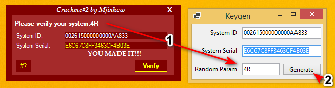

这次的crackme好像不太好搞

serial计算过程中还使用了随机生成的两位值... 一时间我也没想到有什么好方法拿值

于是借着修复程序os>=win7兼容性，把随机值显示在label上了 (/坏笑)

没有示例的 ID/Serial

随机值一位是0~9，一位是Z~A (具体点是前10个)

keygen说明：



细节：

```visual basic
		' Token: 0x06000058 RID: 88 RVA: 0x00004E10 File Offset: 0x00003E10
		Private Sub Button1_Click(sender As Object, e As EventArgs)
			Dim flag As Boolean = (Operators.CompareString(<ID>, Nothing, False) = 0) Or (Operators.CompareString(<Serial>, Nothing, False) = 0)
			If flag Then
				Me.Label5.Text = "Missing information!"
				Me.Label5.Visible = True
			Else
				Me.Label5.Text = "Please wait a few sec..."
				Me.Label5.Visible = True
				Me.Timer1.Start()
			End If
		End Sub

		' Token: 0x06000059 RID: 89 RVA: 0x00004E9C File Offset: 0x00003E9C
		Private Sub Form1_Load(sender As Object, e As EventArgs)
			Dim textBox As Object = Me.TextBox1
			Dim textBox2 As Object = Me.TextBox2
			Me.hash1 = textBox.GetHashCode() // 		0x0202C666
			Me.hash2 = textBox2.GetHashCode() //		0x0218F99C
			Me.code = ToString(GenerateCode())
			Dim text As String = Me.code.Substring(1, 1)
			Me.code = Me.code.Substring(0, 1)
			MyProject.Forms.about.Label1.Text = text
		End Sub

		' Token: 0x0600005A RID: 90 RVA: 0x00004F18 File Offset: 0x00003F18
		Private Sub Timer1_Tick(sender As Object, e As EventArgs)
			Me.Timer1.[Stop]()
			Dim text As String = ToString(Me.xatu(ToString(Me.hash1), ToString(Me.hash2)))
			Dim text2 As String = ToString(Me.MD5(ToString(Me.getID())))
			text2 = text2.Substring(5, 8)
			text2 = ToString(Me.SHA512(text2))
			text2 = ToString(Me.MD5(text2 + text))
			text2 = text2.Substring(8, 16)
			text2 = ToString(modify(text2))
			text2 = ToString(Me.RIP(text2))
			Dim flag As Boolean = ToBoolean(check(<ID>, <Serial>, ToString(Me.getID()), text2)) // <ID> == Me.getID().Replace("-", "") && <Serial> == text2
			If flag Then
				Me.Label5.Text = "YOU MADE IT!!!"
				Me.Timer2.Start()
			Else
				Me.Label5.Text = "Please try again!"
			End If
		End Sub

		' Token: 0x06000033 RID: 51 RVA: 0x000031C4 File Offset: 0x000021C4
		Public Function xatu(a As String, b As String) As Object
			a = b + a
			b = ToString(ToDouble(a) - ToDouble(b))
			Return a + "-" + b
		End Function

        ' ' Token: 0x06000055 RID: 85 RVA: 0x00004D48 File Offset: 0x00003D48
		' Public Function getID() As Object
		' 	Dim registryKey As RegistryKey = Registry.LocalMachine.OpenSubKey("SOFTWARE\Microsoft\Windows\CurrentVersion\", False)
		' 	Return ToString(registryKey.GetValue("ProductId"))
		' End Function

        ' Token: 0x06000055 RID: 85 RVA: 0x00003DC0 File Offset: 0x00001FC0
		Public Function getID() As Object // fix for modern os
			Dim registryKey As RegistryKey = Registry.LocalMachine.OpenSubKey("SOFTWARE\Microsoft\Windows NT\CurrentVersion\", False)
			If registryKey Is Nothing Then
				registryKey = Registry.LocalMachine.OpenSubKey("SOFTWARE\Microsoft\Windows\CurrentVersion\", False)
			End If
			Return ToString(RuntimeHelpers.GetObjectValue(RuntimeHelpers.GetObjectValue(registryKey.GetValue("ProductId"))))
		End Function

        ' Token: 0x06000052 RID: 82 RVA: 0x00004C68 File Offset: 0x00003C68
		Public Function MD5(plaintext As String) As Object
			Dim obj As Object = New UnicodeEncoding()
			Dim md5CryptoServiceProvider As MD5CryptoServiceProvider = New MD5CryptoServiceProvider()
			Dim array As Byte() = Encoding.UTF8.GetBytes(plaintext)
			array = md5CryptoServiceProvider.ComputeHash(array)
			Dim text As String = BitConverter.ToString(array)
			Return text.Replace("-", Nothing)
		End Function

		' Token: 0x06000053 RID: 83 RVA: 0x00003D2C File Offset: 0x00001F2C
		Public Function SHA512(plaintext As String) As Object
			Dim obj As Object = New UnicodeEncoding()
			Dim sha512Managed As SHA512Managed = New SHA512Managed()
			Dim array As Byte() = Encoding.UTF8.GetBytes(plaintext)
			array = sha512Managed.ComputeHash(array)
			Return BitConverter.ToString(array)
		End Function

		' Token: 0x0600002E RID: 46 RVA: 0x00002B40 File Offset: 0x00000D40
		Public Shared Function modify(text As String) As Object
			text = text.Insert(4, "-")
			text = text.Insert(9, "+")
			text = text.Insert(14, "*")
			Dim i As Integer = 0
			Dim text2 As String = ""
			While i < text.Length
				Dim text3 As String = text.Substring(i, 1)
				Dim flag As Boolean = Not Versioned.IsNumeric(text3)
				If flag Then
					text2 += Strings.Asc(text3).ToString().Substring(0, 1)
				Else
					text2 += text3
				End If
				i += 1
			End While
			text2 = text2.Insert(2, MyProject.Forms.about.Label1.Text)
			Return text2 + MyProject.Forms.Form1.code
		End Function

		' Token: 0x06000054 RID: 84 RVA: 0x00003D68 File Offset: 0x00001F68
		Public Function RIP(plaintext As String) As Object
			Dim obj As Object = New UnicodeEncoding()
			Dim ripemd160Managed As RIPEMD160Managed = New RIPEMD160Managed()
			Dim array As Byte() = Encoding.UTF8.GetBytes(plaintext)
			array = ripemd160Managed.ComputeHash(array)
			Dim text As String = BitConverter.ToString(array)
			text = text.Replace("-", Nothing)
			Return text.Substring(4, 20)
		End Function

		' Token: 0x06000030 RID: 48 RVA: 0x00002CDC File Offset: 0x00000EDC
		Public Shared Function check(txt1 As String, txt2 As String, ID As String, ser As String) As Object 
			Dim flag As Boolean = (Operators.CompareString(txt1, ID.Replace("-", ""), False) = 0) And (Operators.CompareString(txt2, ser, False) = 0)
			Return flag
		End Function

        ' Token: 0x0600005B RID: 91 RVA: 0x0000409C File Offset: 0x0000229C
        Private Sub Timer2_Tick(sender As Object, e As EventArgs)
            Dim flag As Boolean = Me.point >= 191
            If flag Then
                Me.turn = True
            End If
            flag = Me.point <= 101
            If flag Then
                Me.turn = False
            End If
            Dim label As Control = Me.Label5
            Dim point As Point = New Point(Me.point, 65)
            label.Location = point
            flag = Me.turn
            If flag Then
                Me.point -= 1
            Else
                flag = Not Me.turn
                If flag Then
                    Me.point += 1
                End If
            End If
        End Sub


```

