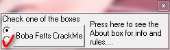

打包工具: ASPack(2.000)

1. 先脱壳

2. 看起来这次不是pcode

3. 做三件事

   ```vb
     loc_00408C3A: var_80 = 10
     loc_00408C41: var_8004 = FreeFile(var_80)
     loc_00408C5C: Open "C:\windows\sailor.hk" For Binary As #var_8004 Len = -1
     loc_00408C72: var_80 = Space(FileLen("C:\windows\sailor.hk"))
     loc_00408C87: var_28 = var_80
     loc_00408C9C: Get #var_8004, var_28
     loc_00408CA3: Close #var_8004
     loc_00408CD6: var_5C = 121230302929#
     loc_00408CFB: var_80 = var_5C - 100
     loc_00408D06: var_4C = var_80
     loc_00408D3F: var_8014 = CBool(Not((var_28 = var_4C)))
     loc_00408D48: If var_8014 = 0 Then
     loc_00408D81:   var_38 = (var_28 + 100)
     loc_00408DAD:   If CBool(Not((var_4C = var_38))) Then
     loc_00408DC1:     Set var_70 = qw.ff
     loc_00408DD1:     var_A8 = var_70
     loc_00408E20:     If (var_70.Value = True) Then
     loc_00408E79:       var_80 = var_5C * 28
     loc_00408E97:       If (var_38 * 28 = var_80) Then
     loc_00408EC3:         qw.Caption = "Nice going"
     loc_00408EF5:         qw.ass.Visible = False
     loc_00408F37:         qw.lk.Visible = True
     loc_00408F64:       End If
     loc_00408F64:     End If
     loc_00408F64:   End If
   ```

   - 新建文件: `C:\windows\sailor.hk`

   - 编辑内容: `121230302829`

   - 选中第二个radio

     

