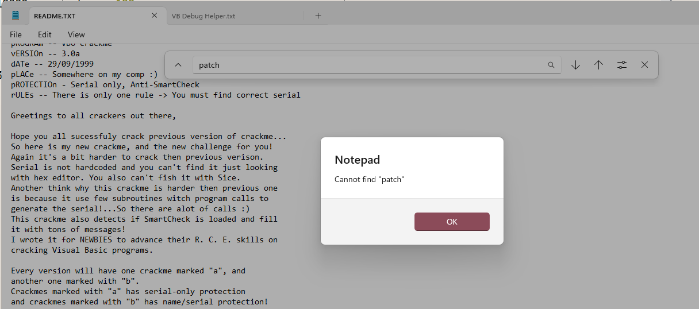

寻找合适的serial

先上答案：

```
serial规则：
长度需要大于等于5
长度-1不能等于serial相同前后相同字符数（换个表达，不能全部相同）
第一位*长度==每位ascii总和
示例：
12101
```

细节：

```assembly
00404230 | 55                   | push ebp                                    | CheckBtn
00404231 | 8BEC                 | mov ebp,esp                                 |
...
...
00404320 | FF15 94104000        | call dword ptr ds:[<Ordinal#535>]           | rtcGetTimer
00404326 | FF15 D0104000        | call dword ptr ds:[<__vbaFpI4>]             |
0040432C | 8945 A4              | mov dword ptr ss:[ebp-5C],eax               |
0040432F | 8D95 08FFFFFF        | lea edx,dword ptr ss:[ebp-F8]               | edx:EntryPoint
00404335 | 8D85 F8FEFFFF        | lea eax,dword ptr ss:[ebp-108]              |
0040433B | 52                   | push edx                                    | edx:EntryPoint
0040433C | 8D8D E8FEFFFF        | lea ecx,dword ptr ss:[ebp-118]              | ecx:EntryPoint
00404342 | 50                   | push eax                                    |
00404343 | 8D95 A4FEFFFF        | lea edx,dword ptr ss:[ebp-15C]              | edx:EntryPoint
00404349 | 51                   | push ecx                                    | ecx:EntryPoint
0040434A | 8D85 B4FEFFFF        | lea eax,dword ptr ss:[ebp-14C]              |
00404350 | 52                   | push edx                                    | edx:EntryPoint
00404351 | 8D4D 80              | lea ecx,dword ptr ss:[ebp-80]               | ecx:EntryPoint
00404354 | BB 02000000          | mov ebx,2                                   |
00404359 | 50                   | push eax                                    |
0040435A | 51                   | push ecx                                    | ecx:EntryPoint
0040435B | C785 10FFFFFF 010000 | mov dword ptr ss:[ebp-F0],1                 |
00404365 | 899D 08FFFFFF        | mov dword ptr ss:[ebp-F8],ebx               |
0040436B | C785 00FFFFFF E80300 | mov dword ptr ss:[ebp-100],3E8              |
00404375 | 899D F8FEFFFF        | mov dword ptr ss:[ebp-108],ebx              |
0040437B | C785 F0FEFFFF 010000 | mov dword ptr ss:[ebp-110],1                |
00404385 | 899D E8FEFFFF        | mov dword ptr ss:[ebp-118],ebx              |
0040438B | FF15 38104000        | call dword ptr ds:[<__vbaVarForInit>]       |
00404391 | 3BC7                 | cmp eax,edi                                 | edi:EntryPoint
00404393 | 0F84 C8000000        | je bjcm30a.exe1.404461                      |
00404399 | B8 01000000          | mov eax,1                                   |
0040439E | 8D95 08FFFFFF        | lea edx,dword ptr ss:[ebp-F8]               | edx:EntryPoint
004043A4 | 8985 10FFFFFF        | mov dword ptr ss:[ebp-F0],eax               |
004043AA | 8985 F0FEFFFF        | mov dword ptr ss:[ebp-110],eax              |
004043B0 | 8D85 F8FEFFFF        | lea eax,dword ptr ss:[ebp-108]              |
004043B6 | 52                   | push edx                                    | edx:EntryPoint
004043B7 | 8D8D E8FEFFFF        | lea ecx,dword ptr ss:[ebp-118]              | ecx:EntryPoint
004043BD | 50                   | push eax                                    |
004043BE | 8D95 84FEFFFF        | lea edx,dword ptr ss:[ebp-17C]              | edx:EntryPoint
004043C4 | 51                   | push ecx                                    | ecx:EntryPoint
004043C5 | 8D85 94FEFFFF        | lea eax,dword ptr ss:[ebp-16C]              |
004043CB | 52                   | push edx                                    | edx:EntryPoint
004043CC | 8D4D A8              | lea ecx,dword ptr ss:[ebp-58]               | ecx:EntryPoint
004043CF | 50                   | push eax                                    |
004043D0 | 51                   | push ecx                                    | ecx:EntryPoint
004043D1 | 899D 08FFFFFF        | mov dword ptr ss:[ebp-F8],ebx               |
004043D7 | C785 00FFFFFF FA0000 | mov dword ptr ss:[ebp-100],FA               |
004043E1 | 899D F8FEFFFF        | mov dword ptr ss:[ebp-108],ebx              |
004043E7 | 899D E8FEFFFF        | mov dword ptr ss:[ebp-118],ebx              |
004043ED | FF15 38104000        | call dword ptr ds:[<__vbaVarForInit>]       |
004043F3 | 3BC7                 | cmp eax,edi                                 | edi:EntryPoint
004043F5 | 74 4D                | je bjcm30a.exe1.404444                      |
004043F7 | 68 342A4000          | push bjcm30a.exe1.402A34                    | 402A34:L"IS SMARTCHECK LOADED???"
004043FC | 68 342A4000          | push bjcm30a.exe1.402A34                    | 402A34:L"IS SMARTCHECK LOADED???"
00404401 | FF15 68104000        | call dword ptr ds:[<__vbaStrCmp>]           |
00404407 | 85C0                 | test eax,eax                                |
00404409 | 75 1F                | jne bjcm30a.exe1.40442A                     |
0040440B | 8D95 08FFFFFF        | lea edx,dword ptr ss:[ebp-F8]               | edx:EntryPoint
00404411 | 8D4D DC              | lea ecx,dword ptr ss:[ebp-24]               | ecx:EntryPoint
00404414 | C785 10FFFFFF 010000 | mov dword ptr ss:[ebp-F0],1                 |
0040441E | 899D 08FFFFFF        | mov dword ptr ss:[ebp-F8],ebx               |
00404424 | FF15 08104000        | call dword ptr ds:[<__vbaVarMove>]          |
0040442A | 8D95 84FEFFFF        | lea edx,dword ptr ss:[ebp-17C]              | edx:EntryPoint
00404430 | 8D85 94FEFFFF        | lea eax,dword ptr ss:[ebp-16C]              |
00404436 | 52                   | push edx                                    | edx:EntryPoint
00404437 | 8D4D A8              | lea ecx,dword ptr ss:[ebp-58]               | ecx:EntryPoint
0040443A | 50                   | push eax                                    |
0040443B | 51                   | push ecx                                    | ecx:EntryPoint
0040443C | FF15 E8104000        | call dword ptr ds:[<__vbaVarForNext>]       |
00404442 | EB AF                | jmp bjcm30a.exe1.4043F3                     |
00404444 | 8D95 A4FEFFFF        | lea edx,dword ptr ss:[ebp-15C]              | edx:EntryPoint
0040444A | 8D85 B4FEFFFF        | lea eax,dword ptr ss:[ebp-14C]              |
00404450 | 52                   | push edx                                    | edx:EntryPoint
00404451 | 8D4D 80              | lea ecx,dword ptr ss:[ebp-80]               | ecx:EntryPoint
00404454 | 50                   | push eax                                    |
00404455 | 51                   | push ecx                                    | ecx:EntryPoint
00404456 | FF15 E8104000        | call dword ptr ds:[<__vbaVarForNext>]       |
0040445C | E9 30FFFFFF          | jmp bjcm30a.exe1.404391                     |
00404461 | FF15 94104000        | call dword ptr ds:[<Ordinal#535>]           |
00404467 | FF15 D0104000        | call dword ptr ds:[<__vbaFpI4>]             |
0040446D | 2B45 A4              | sub eax,dword ptr ss:[ebp-5C]               |
00404470 | 0F80 340C0000        | jo bjcm30a.exe1.4050AA                      |
00404476 | 83F8 05              | cmp eax,5                                   |
00404479 | 0F8E AD000000        | jle bjcm30a.exe1.40452C                     |
0040447F | 8B1D CC104000        | mov ebx,dword ptr ds:[<__vbaVarDup>]        |
00404485 | B9 04000280          | mov ecx,80020004                            | ecx:EntryPoint
0040448A | 898D 20FFFFFF        | mov dword ptr ss:[ebp-E0],ecx               | ecx:EntryPoint
00404490 | B8 0A000000          | mov eax,A                                   | 0A:'\n'
00404495 | 898D 30FFFFFF        | mov dword ptr ss:[ebp-D0],ecx               | ecx:EntryPoint
0040449B | BE 08000000          | mov esi,8                                   | esi:EntryPoint
004044A0 | 8D95 F8FEFFFF        | lea edx,dword ptr ss:[ebp-108]              | edx:EntryPoint
004044A6 | 8D8D 38FFFFFF        | lea ecx,dword ptr ss:[ebp-C8]               | ecx:EntryPoint
004044AC | 8985 18FFFFFF        | mov dword ptr ss:[ebp-E8],eax               |
004044B2 | 8985 28FFFFFF        | mov dword ptr ss:[ebp-D8],eax               |
004044B8 | C785 00FFFFFF E02A40 | mov dword ptr ss:[ebp-100],bjcm30a.exe1.402 | 402AE0:L"Cheater!!!   CHEATER!!!   Cheater!!!   CHEATER!!!"
004044C2 | 89B5 F8FEFFFF        | mov dword ptr ss:[ebp-108],esi              | esi:EntryPoint
004044C8 | FFD3                 | call ebx                                    |
004044CA | 8D95 08FFFFFF        | lea edx,dword ptr ss:[ebp-F8]               | edx:EntryPoint
004044D0 | 8D8D 48FFFFFF        | lea ecx,dword ptr ss:[ebp-B8]               | ecx:EntryPoint
004044D6 | C785 10FFFFFF 682A40 | mov dword ptr ss:[ebp-F0],bjcm30a.exe1.402A | 402A68:L"  You have SmartCheck loaded!...Close it and try again!!!"
004044E0 | 89B5 08FFFFFF        | mov dword ptr ss:[ebp-F8],esi               | esi:EntryPoint
004044E6 | FFD3                 | call ebx                                    |
004044E8 | 8D95 18FFFFFF        | lea edx,dword ptr ss:[ebp-E8]               | edx:EntryPoint
004044EE | 8D85 28FFFFFF        | lea eax,dword ptr ss:[ebp-D8]               |
004044F4 | 52                   | push edx                                    | edx:EntryPoint
004044F5 | 8D8D 38FFFFFF        | lea ecx,dword ptr ss:[ebp-C8]               | ecx:EntryPoint
004044FB | 50                   | push eax                                    |
004044FC | 51                   | push ecx                                    | ecx:EntryPoint
004044FD | 8D95 48FFFFFF        | lea edx,dword ptr ss:[ebp-B8]               | edx:EntryPoint
00404503 | 57                   | push edi                                    | edi:EntryPoint
00404504 | 52                   | push edx                                    | edx:EntryPoint
00404505 | FF15 3C104000        | call dword ptr ds:[<Ordinal#595>]           |
0040450B | 8D85 18FFFFFF        | lea eax,dword ptr ss:[ebp-E8]               |
00404511 | 8D8D 28FFFFFF        | lea ecx,dword ptr ss:[ebp-D8]               | ecx:EntryPoint
00404517 | 50                   | push eax                                    |
00404518 | 8D95 38FFFFFF        | lea edx,dword ptr ss:[ebp-C8]               | edx:EntryPoint
0040451E | 51                   | push ecx                                    | ecx:EntryPoint
0040451F | 8D85 48FFFFFF        | lea eax,dword ptr ss:[ebp-B8]               |
00404525 | 52                   | push edx                                    | edx:EntryPoint
00404526 | 50                   | push eax                                    |
00404527 | E9 5A0A0000          | jmp bjcm30a.exe1.404F86                     | 以上检测调试器是否存在（检查时间间隔）
```

找个理由Patch: 



```assembly
00404320 | FF15 94104000        | call dword ptr ds:[<Ordinal#535>]           | rtcGetTimer
↓
00404320 | E9 07020000          | jmp bjcm30a.40452C                          | 跳过检测
```

检查serial长度:

```assembly
0040452C | 8B0E                 | mov ecx,dword ptr ds:[esi]                  | ecx:&L"31", esi:"tj@"
0040452E | 56                   | push esi                                    | esi:"tj@"
0040452F | FF91 08030000        | call dword ptr ds:[ecx+308]                 |
00404535 | 8D95 5CFFFFFF        | lea edx,dword ptr ss:[ebp-A4]               |
0040453B | 50                   | push eax                                    |
0040453C | 52                   | push edx                                    | edx:"|璵"
0040453D | FF15 40104000        | call dword ptr ds:[<__vbaObjSet>]           |
00404543 | 8BD8                 | mov ebx,eax                                 | ebx:__vbaStrMove
00404545 | 8D8D 7CFFFFFF        | lea ecx,dword ptr ss:[ebp-84]               | [ebp-84]:L"101010"
0040454B | 51                   | push ecx                                    | ecx:&L"31"
0040454C | 53                   | push ebx                                    | ebx:__vbaStrMove
0040454D | 8B03                 | mov eax,dword ptr ds:[ebx]                  | ebx:__vbaStrMove
0040454F | FF90 A0000000        | call dword ptr ds:[eax+A0]                  | 
00404555 | 3BC7                 | cmp eax,edi                                 |
00404557 | DBE2                 | fnclex                                      |
00404559 | 7D 12                | jge bjcm30a.40456D                          |
0040455B | 68 A0000000          | push A0                                     |
00404560 | 68 442B4000          | push bjcm30a.402B44                         |
00404565 | 53                   | push ebx                                    | ebx:__vbaStrMove
00404566 | 50                   | push eax                                    |
00404567 | FF15 30104000        | call dword ptr ds:[<__vbaHresultCheckObj>]  |
0040456D | 8B95 7CFFFFFF        | mov edx,dword ptr ss:[ebp-84]               | [ebp-84]:L"101010"
00404573 | 52                   | push edx                                    | edx:"|璵"
00404574 | FF15 14104000        | call dword ptr ds:[<__vbaLenBstr>]          |
0040457A | 33DB                 | xor ebx,ebx                                 | ebx:__vbaStrMove
0040457C | 83F8 05              | cmp eax,5                                   | Serial.Length>=5
0040457F | 0F9CC3               | setl bl                                     |
00404582 | 8D8D 7CFFFFFF        | lea ecx,dword ptr ss:[ebp-84]               | [ebp-84]:L"101010"
00404588 | F7DB                 | neg ebx                                     | ebx:__vbaStrMove
0040458A | FF15 F0104000        | call dword ptr ds:[<__vbaFreeStr>]          |
00404590 | 8D8D 5CFFFFFF        | lea ecx,dword ptr ss:[ebp-A4]               |
00404596 | FF15 F4104000        | call dword ptr ds:[<__vbaFreeObj>]          |
0040459C | 66:3BDF              | cmp bx,di                                   |
0040459F | 0F85 39090000        | jne <bjcm30a.Fail>                          |
```

检查输入的serial是否全部相同:

```assembly
0040466E | FF15 38104000        | call dword ptr ds:[<__vbaVarForInit>]       |
00404674 | 8D8D 7CFFFFFF        | lea ecx,dword ptr ss:[ebp-84]               | [ebp-84]:L"101010"
0040467A | 8985 30FEFFFF        | mov dword ptr ss:[ebp-1D0],eax              |
00404680 | FF15 F0104000        | call dword ptr ds:[<__vbaFreeStr>]          |
00404686 | 8D8D 5CFFFFFF        | lea ecx,dword ptr ss:[ebp-A4]               |
0040468C | FF15 F4104000        | call dword ptr ds:[<__vbaFreeObj>]          |
00404692 | 8B1D DC104000        | mov ebx,dword ptr ds:[<__vbaStrMove>]       | ebx:__vbaStrMove
00404698 | 39BD 30FEFFFF        | cmp dword ptr ss:[ebp-1D0],edi              | LOOP(不能全部相同
0040469E | 0F84 F5010000        | je bjcm30a.404899                           |
004046A4 | 8B16                 | mov edx,dword ptr ds:[esi]                  | edx:"|璵", esi:"tj@"
004046A6 | 56                   | push esi                                    | esi:"tj@"
004046A7 | FF92 08030000        | call dword ptr ds:[edx+308]                 |
004046AD | 50                   | push eax                                    |
004046AE | 8D85 5CFFFFFF        | lea eax,dword ptr ss:[ebp-A4]               |
004046B4 | 50                   | push eax                                    |
004046B5 | FF15 40104000        | call dword ptr ds:[<__vbaObjSet>]           |
004046BB | 8B08                 | mov ecx,dword ptr ds:[eax]                  | ecx:&L"31", [eax]:BASIC_CLASS_QueryInterface
004046BD | 8D95 7CFFFFFF        | lea edx,dword ptr ss:[ebp-84]               | [ebp-84]:L"101010"
004046C3 | 52                   | push edx                                    | edx:"|璵"
004046C4 | 50                   | push eax                                    |
004046C5 | 8985 D4FEFFFF        | mov dword ptr ss:[ebp-12C],eax              |
004046CB | FF91 A0000000        | call dword ptr ds:[ecx+A0]                  | [ecx+A0]:L"沁ФC"
004046D1 | 3BC7                 | cmp eax,edi                                 |
004046D3 | DBE2                 | fnclex                                      |
004046D5 | 7D 18                | jge bjcm30a.4046EF                          |
004046D7 | 8B8D D4FEFFFF        | mov ecx,dword ptr ss:[ebp-12C]              |
004046DD | 68 A0000000          | push A0                                     |
004046E2 | 68 442B4000          | push bjcm30a.402B44                         |
004046E7 | 51                   | push ecx                                    | ecx:&L"31"
004046E8 | 50                   | push eax                                    |
004046E9 | FF15 30104000        | call dword ptr ds:[<__vbaHresultCheckObj>]  |
004046EF | 8B16                 | mov edx,dword ptr ds:[esi]                  | edx:"|璵", esi:"tj@"
004046F1 | 56                   | push esi                                    | esi:"tj@"
004046F2 | FF92 08030000        | call dword ptr ds:[edx+308]                 |
004046F8 | 50                   | push eax                                    |
004046F9 | 8D85 58FFFFFF        | lea eax,dword ptr ss:[ebp-A8]               |
004046FF | 50                   | push eax                                    |
00404700 | FF15 40104000        | call dword ptr ds:[<__vbaObjSet>]           |
00404706 | 8B08                 | mov ecx,dword ptr ds:[eax]                  | ecx:&L"31", [eax]:BASIC_CLASS_QueryInterface
00404708 | 8D95 78FFFFFF        | lea edx,dword ptr ss:[ebp-88]               |
0040470E | 52                   | push edx                                    | edx:"|璵"
0040470F | 50                   | push eax                                    |
00404710 | 8985 CCFEFFFF        | mov dword ptr ss:[ebp-134],eax              |
00404716 | FF91 A0000000        | call dword ptr ds:[ecx+A0]                  | [ecx+A0]:L"沁ФC"
0040471C | 3BC7                 | cmp eax,edi                                 |
0040471E | DBE2                 | fnclex                                      |
00404720 | 7D 18                | jge bjcm30a.40473A                          |
00404722 | 8B8D CCFEFFFF        | mov ecx,dword ptr ss:[ebp-134]              |
00404728 | 68 A0000000          | push A0                                     |
0040472D | 68 442B4000          | push bjcm30a.402B44                         |
00404732 | 51                   | push ecx                                    | ecx:&L"31"
00404733 | 50                   | push eax                                    |
00404734 | FF15 30104000        | call dword ptr ds:[<__vbaHresultCheckObj>]  |
0040473A | B8 01000000          | mov eax,1                                   |
0040473F | 8D95 48FFFFFF        | lea edx,dword ptr ss:[ebp-B8]               |
00404745 | 8985 50FFFFFF        | mov dword ptr ss:[ebp-B0],eax               |
0040474B | 8985 30FFFFFF        | mov dword ptr ss:[ebp-D0],eax               |
00404751 | 8985 00FFFFFF        | mov dword ptr ss:[ebp-100],eax              |
00404757 | 8D45 94              | lea eax,dword ptr ss:[ebp-6C]               |
0040475A | B9 02000000          | mov ecx,2                                   | ecx:&L"31"
0040475F | 52                   | push edx                                    | edx:"|璵"
00404760 | 50                   | push eax                                    |
00404761 | 898D 48FFFFFF        | mov dword ptr ss:[ebp-B8],ecx               |
00404767 | 898D 28FFFFFF        | mov dword ptr ss:[ebp-D8],ecx               | [ebp-D8]:VarParseNumFromStr+4F8
0040476D | 898D F8FEFFFF        | mov dword ptr ss:[ebp-108],ecx              |
00404773 | FF15 C4104000        | call dword ptr ds:[<__vbaI4Var>]            |
00404779 | 8B8D 7CFFFFFF        | mov ecx,dword ptr ss:[ebp-84]               | [ebp-84]:L"101010"
0040477F | 8B3D 54104000        | mov edi,dword ptr ds:[<Ordinal#631>]        |
00404785 | 50                   | push eax                                    |
00404786 | 51                   | push ecx                                    | 提取1位
00404787 | FFD7                 | call edi                                    | edi:rtcMidCharBstr
00404789 | 8BD0                 | mov edx,eax                                 | edx:"|璵"
0040478B | 8D8D 74FFFFFF        | lea ecx,dword ptr ss:[ebp-8C]               |
00404791 | FFD3                 | call ebx                                    | ebx:__vbaStrMove
00404793 | 50                   | push eax                                    |
00404794 | 8D95 28FFFFFF        | lea edx,dword ptr ss:[ebp-D8]               | [ebp-D8]:VarParseNumFromStr+4F8
0040479A | 8D45 94              | lea eax,dword ptr ss:[ebp-6C]               |
0040479D | 52                   | push edx                                    | edx:"|璵"
0040479E | 8D8D F8FEFFFF        | lea ecx,dword ptr ss:[ebp-108]              |
004047A4 | 50                   | push eax                                    |
004047A5 | 8D95 38FFFFFF        | lea edx,dword ptr ss:[ebp-C8]               |
004047AB | 51                   | push ecx                                    | ecx:&L"31"
004047AC | 52                   | push edx                                    | edx:"|璵"
004047AD | FF15 C8104000        | call dword ptr ds:[<__vbaVarAdd>]           |
004047B3 | 50                   | push eax                                    |
004047B4 | FF15 C4104000        | call dword ptr ds:[<__vbaI4Var>]            |
004047BA | 50                   | push eax                                    |
004047BB | 8B85 78FFFFFF        | mov eax,dword ptr ss:[ebp-88]               |
004047C1 | 50                   | push eax                                    |
004047C2 | FFD7                 | call edi                                    |
004047C4 | 8BD0                 | mov edx,eax                                 | edx:"|璵"
004047C6 | 8D8D 70FFFFFF        | lea ecx,dword ptr ss:[ebp-90]               | [ebp-90]:L"31"
004047CC | FFD3                 | call ebx                                    | ebx:__vbaStrMove
004047CE | 50                   | push eax                                    |
004047CF | FF15 68104000        | call dword ptr ds:[<__vbaStrCmp>]           | 前后字符比较
004047D5 | 8BF8                 | mov edi,eax                                 |
004047D7 | 8D8D 70FFFFFF        | lea ecx,dword ptr ss:[ebp-90]               | [ebp-90]:L"31"
004047DD | F7DF                 | neg edi                                     |
004047DF | 8D95 74FFFFFF        | lea edx,dword ptr ss:[ebp-8C]               |
004047E5 | 51                   | push ecx                                    | ecx:&L"31"
004047E6 | 8D85 78FFFFFF        | lea eax,dword ptr ss:[ebp-88]               |
004047EC | 52                   | push edx                                    | edx:"|璵"
004047ED | 1BFF                 | sbb edi,edi                                 |
004047EF | 8D8D 7CFFFFFF        | lea ecx,dword ptr ss:[ebp-84]               | [ebp-84]:L"101010"
004047F5 | 50                   | push eax                                    |
004047F6 | 47                   | inc edi                                     |
004047F7 | 51                   | push ecx                                    | ecx:&L"31"
004047F8 | 6A 04                | push 4                                      |
004047FA | F7DF                 | neg edi                                     |
004047FC | FF15 B4104000        | call dword ptr ds:[<__vbaFreeStrList>]      |
00404802 | 8D95 58FFFFFF        | lea edx,dword ptr ss:[ebp-A8]               |
00404808 | 8D85 5CFFFFFF        | lea eax,dword ptr ss:[ebp-A4]               |
0040480E | 52                   | push edx                                    | edx:"|璵"
0040480F | 50                   | push eax                                    |
00404810 | 6A 02                | push 2                                      |
00404812 | FF15 24104000        | call dword ptr ds:[<__vbaFreeObjList>]      |
00404818 | 8D8D 28FFFFFF        | lea ecx,dword ptr ss:[ebp-D8]               | [ebp-D8]:VarParseNumFromStr+4F8
0040481E | 8D95 38FFFFFF        | lea edx,dword ptr ss:[ebp-C8]               |
00404824 | 51                   | push ecx                                    | ecx:&L"31"
00404825 | 8D85 48FFFFFF        | lea eax,dword ptr ss:[ebp-B8]               |
0040482B | 52                   | push edx                                    | edx:"|璵"
0040482C | 50                   | push eax                                    |
0040482D | 6A 03                | push 3                                      |
0040482F | FF15 18104000        | call dword ptr ds:[<__vbaFreeVarList>]      |
00404835 | 83C4 30              | add esp,30                                  |
00404838 | 66:85FF              | test di,di                                  |
0040483B | 74 37                | je bjcm30a.404874                           |
0040483D | 8D4D B8              | lea ecx,dword ptr ss:[ebp-48]               |
00404840 | 8D95 08FFFFFF        | lea edx,dword ptr ss:[ebp-F8]               |
00404846 | 51                   | push ecx                                    | ecx:&L"31"
00404847 | 8D85 48FFFFFF        | lea eax,dword ptr ss:[ebp-B8]               |
0040484D | 52                   | push edx                                    | edx:"|璵"
0040484E | 50                   | push eax                                    |
0040484F | C785 10FFFFFF 010000 | mov dword ptr ss:[ebp-F0],1                 |
00404859 | C785 08FFFFFF 020000 | mov dword ptr ss:[ebp-F8],2                 |
00404863 | FF15 C8104000        | call dword ptr ds:[<__vbaVarAdd>]           |
00404869 | 8BD0                 | mov edx,eax                                 | edx:"|璵"
0040486B | 8D4D B8              | lea ecx,dword ptr ss:[ebp-48]               |
0040486E | FF15 08104000        | call dword ptr ds:[<__vbaVarMove>]          |
00404874 | 8D8D 64FEFFFF        | lea ecx,dword ptr ss:[ebp-19C]              |
0040487A | 8D95 74FEFFFF        | lea edx,dword ptr ss:[ebp-18C]              |
00404880 | 51                   | push ecx                                    | ecx:&L"31"
00404881 | 8D45 94              | lea eax,dword ptr ss:[ebp-6C]               |
00404884 | 52                   | push edx                                    | edx:"|璵"
00404885 | 50                   | push eax                                    |
00404886 | FF15 E8104000        | call dword ptr ds:[<__vbaVarForNext>]       |
0040488C | 8985 30FEFFFF        | mov dword ptr ss:[ebp-1D0],eax              |
00404892 | 33FF                 | xor edi,edi                                 |
00404894 | E9 FFFDFFFF          | jmp bjcm30a.404698                          | Next Loop
00404899 | 8B0E                 | mov ecx,dword ptr ds:[esi]                  | ecx:&L"31", esi:"tj@"
0040489B | 56                   | push esi                                    | esi:"tj@"
0040489C | FF91 08030000        | call dword ptr ds:[ecx+308]                 |
004048A2 | 8D95 5CFFFFFF        | lea edx,dword ptr ss:[ebp-A4]               |
004048A8 | 50                   | push eax                                    |
004048A9 | 52                   | push edx                                    | edx:"|璵"
004048AA | FF15 40104000        | call dword ptr ds:[<__vbaObjSet>]           |
004048B0 | 8B08                 | mov ecx,dword ptr ds:[eax]                  | ecx:&L"31", [eax]:BASIC_CLASS_QueryInterface
004048B2 | 8D95 7CFFFFFF        | lea edx,dword ptr ss:[ebp-84]               | [ebp-84]:L"101010"
004048B8 | 52                   | push edx                                    | edx:"|璵"
004048B9 | 50                   | push eax                                    |
004048BA | 8985 D4FEFFFF        | mov dword ptr ss:[ebp-12C],eax              |
004048C0 | FF91 A0000000        | call dword ptr ds:[ecx+A0]                  | [ecx+A0]:L"沁ФC"
004048C6 | 3BC7                 | cmp eax,edi                                 |
004048C8 | DBE2                 | fnclex                                      |
004048CA | 7D 18                | jge bjcm30a.4048E4                          |
004048CC | 8B8D D4FEFFFF        | mov ecx,dword ptr ss:[ebp-12C]              |
004048D2 | 68 A0000000          | push A0                                     |
004048D7 | 68 442B4000          | push bjcm30a.402B44                         |
004048DC | 51                   | push ecx                                    | ecx:&L"31"
004048DD | 50                   | push eax                                    |
004048DE | FF15 30104000        | call dword ptr ds:[<__vbaHresultCheckObj>]  |
004048E4 | 8B95 7CFFFFFF        | mov edx,dword ptr ss:[ebp-84]               | [ebp-84]:L"101010"
004048EA | 52                   | push edx                                    | edx:"|璵"
004048EB | FF15 14104000        | call dword ptr ds:[<__vbaLenBstr>]          |
004048F1 | 83E8 01              | sub eax,1                                   |
004048F4 | 8D8D 08FFFFFF        | lea ecx,dword ptr ss:[ebp-F8]               |
004048FA | 0F80 AA070000        | jo <bjcm30a.ErrOverflow>                    |
00404900 | 8985 10FFFFFF        | mov dword ptr ss:[ebp-F0],eax               |
00404906 | 8D45 B8              | lea eax,dword ptr ss:[ebp-48]               |
00404909 | 50                   | push eax                                    |
0040490A | 51                   | push ecx                                    | ecx:&L"31"
0040490B | C785 08FFFFFF 038000 | mov dword ptr ss:[ebp-F8],8003              |
00404915 | FF15 6C104000        | call dword ptr ds:[<__vbaVarTstEq>]         |
0040491B | 8D8D 7CFFFFFF        | lea ecx,dword ptr ss:[ebp-84]               | [ebp-84]:L"101010"
00404921 | 66:8985 CCFEFFFF     | mov word ptr ss:[ebp-134],ax                |
00404928 | FF15 F0104000        | call dword ptr ds:[<__vbaFreeStr>]          |
0040492E | 8D8D 5CFFFFFF        | lea ecx,dword ptr ss:[ebp-A4]               |
00404934 | FF15 F4104000        | call dword ptr ds:[<__vbaFreeObj>]          |
0040493A | 66:39BD CCFEFFFF     | cmp word ptr ss:[ebp-134],di                |
00404941 | 0F85 97050000        | jne <bjcm30a.Fail>                          |
```

下面是计算第一位*长度和每位ascii总和并判断是否相等

```assembly
00404A16 | 8D8D 5CFFFFFF        | lea ecx,dword ptr ss:[ebp-A4]               |
00404A1C | FF15 F4104000        | call dword ptr ds:[<__vbaFreeObj>]          |
00404A22 | 39BD 2CFEFFFF        | cmp dword ptr ss:[ebp-1D4],edi              | LOOP
00404A28 | 0F84 1D030000        | je bjcm30a.404D4B                           |
00404A2E | 8B06                 | mov eax,dword ptr ds:[esi]                  | esi:"tj@"
00404A30 | 56                   | push esi                                    | esi:"tj@"
00404A31 | FF90 08030000        | call dword ptr ds:[eax+308]                 | [eax+308]:__vbaStr2Vec+68D
00404A37 | 8D8D 5CFFFFFF        | lea ecx,dword ptr ss:[ebp-A4]               |
00404A3D | 50                   | push eax                                    |
00404A3E | 51                   | push ecx                                    | ecx:&L"31"
00404A3F | FF15 40104000        | call dword ptr ds:[<__vbaObjSet>]           |
00404A45 | 8B10                 | mov edx,dword ptr ds:[eax]                  | edx:"|璵", [eax]:BASIC_CLASS_QueryInterface
00404A47 | 8D8D 7CFFFFFF        | lea ecx,dword ptr ss:[ebp-84]               | [ebp-84]:L"101010"
00404A4D | 51                   | push ecx                                    | ecx:&L"31"
00404A4E | 50                   | push eax                                    |
00404A4F | 8985 D4FEFFFF        | mov dword ptr ss:[ebp-12C],eax              |
00404A55 | FF92 A0000000        | call dword ptr ds:[edx+A0]                  |
00404A5B | 3BC7                 | cmp eax,edi                                 |
00404A5D | DBE2                 | fnclex                                      |
00404A5F | 7D 18                | jge bjcm30a.404A79                          |
00404A61 | 8B95 D4FEFFFF        | mov edx,dword ptr ss:[ebp-12C]              |
00404A67 | 68 A0000000          | push A0                                     |
00404A6C | 68 442B4000          | push bjcm30a.402B44                         |
00404A71 | 52                   | push edx                                    | edx:"|璵"
00404A72 | 50                   | push eax                                    |
00404A73 | FF15 30104000        | call dword ptr ds:[<__vbaHresultCheckObj>]  |
00404A79 | 8B85 7CFFFFFF        | mov eax,dword ptr ss:[ebp-84]               | [ebp-84]:L"101010"
00404A7F | 50                   | push eax                                    |
00404A80 | FF15 14104000        | call dword ptr ds:[<__vbaLenBstr>]          |
00404A86 | 8D8D 48FFFFFF        | lea ecx,dword ptr ss:[ebp-B8]               |
00404A8C | 8985 50FFFFFF        | mov dword ptr ss:[ebp-B0],eax               |
00404A92 | 51                   | push ecx                                    | ecx:&L"31"
00404A93 | C785 48FFFFFF 030000 | mov dword ptr ss:[ebp-B8],3                 |
00404A9D | FF15 A8104000        | call dword ptr ds:[<Ordinal#572>]           |
00404AA3 | 8BD0                 | mov edx,eax                                 | edx:"|璵"
00404AA5 | 8D8D 64FFFFFF        | lea ecx,dword ptr ss:[ebp-9C]               |
00404AAB | FFD3                 | call ebx                                    | ebx:__vbaStrMove
00404AAD | 8B16                 | mov edx,dword ptr ds:[esi]                  | edx:"|璵", esi:"tj@"
00404AAF | 56                   | push esi                                    | esi:"tj@"
00404AB0 | FF92 08030000        | call dword ptr ds:[edx+308]                 |
00404AB6 | 50                   | push eax                                    |
00404AB7 | 8D85 58FFFFFF        | lea eax,dword ptr ss:[ebp-A8]               |
00404ABD | 50                   | push eax                                    |
00404ABE | FF15 40104000        | call dword ptr ds:[<__vbaObjSet>]           |
00404AC4 | 8B85 58FFFFFF        | mov eax,dword ptr ss:[ebp-A8]               |
00404ACA | 8D8D 38FFFFFF        | lea ecx,dword ptr ss:[ebp-C8]               |
00404AD0 | 6A 01                | push 1                                      |
00404AD2 | 8D95 28FFFFFF        | lea edx,dword ptr ss:[ebp-D8]               | [ebp-D8]:VarParseNumFromStr+4F8
00404AD8 | 51                   | push ecx                                    | ecx:&L"31"
00404AD9 | 52                   | push edx                                    | edx:"|璵"
00404ADA | 89BD 58FFFFFF        | mov dword ptr ss:[ebp-A8],edi               |
00404AE0 | 8985 40FFFFFF        | mov dword ptr ss:[ebp-C0],eax               |
00404AE6 | C785 38FFFFFF 090000 | mov dword ptr ss:[ebp-C8],9                 | 09:'\t'
00404AF0 | FF15 D4104000        | call dword ptr ds:[<Ordinal#617>]           | rtcLeftCharVar
00404AF6 | 8D85 28FFFFFF        | lea eax,dword ptr ss:[ebp-D8]               | [ebp-D8]:VarParseNumFromStr+4F8
00404AFC | 8D8D 78FFFFFF        | lea ecx,dword ptr ss:[ebp-88]               |
00404B02 | 50                   | push eax                                    |
00404B03 | 51                   | push ecx                                    | ecx:&L"31"
00404B04 | FF15 90104000        | call dword ptr ds:[<__vbaStrVarVal>]        |
00404B0A | 50                   | push eax                                    |
00404B0B | FF15 28104000        | call dword ptr ds:[<Ordinal#516>]           |
00404B11 | 8D95 18FFFFFF        | lea edx,dword ptr ss:[ebp-E8]               |
00404B17 | 66:8985 20FFFFFF     | mov word ptr ss:[ebp-E0],ax                 | ascii
00404B1E | 52                   | push edx                                    | edx:"|璵"
00404B1F | C785 18FFFFFF 020000 | mov dword ptr ss:[ebp-E8],2                 |
00404B29 | FF15 A8104000        | call dword ptr ds:[<Ordinal#572>]           |
00404B2F | 8BD0                 | mov edx,eax                                 | string(ascii)
00404B31 | 8D8D 60FFFFFF        | lea ecx,dword ptr ss:[ebp-A0]               |
00404B37 | FFD3                 | call ebx                                    | ebx:__vbaStrMove
00404B39 | BA 6C294000          | mov edx,bjcm30a.40296C                      | *
00404B3E | 8D8D 6CFFFFFF        | lea ecx,dword ptr ss:[ebp-94]               |
00404B44 | FF15 B0104000        | call dword ptr ds:[<__vbaStrCopy>]          |
00404B4A | 8B95 60FFFFFF        | mov edx,dword ptr ss:[ebp-A0]               |
00404B50 | 8D8D 70FFFFFF        | lea ecx,dword ptr ss:[ebp-90]               | [ebp-90]:L"31"
00404B56 | 89BD 60FFFFFF        | mov dword ptr ss:[ebp-A0],edi               |
00404B5C | FFD3                 | call ebx                                    | ebx:__vbaStrMove
00404B5E | 8B95 64FFFFFF        | mov edx,dword ptr ss:[ebp-9C]               |
00404B64 | 8D8D 74FFFFFF        | lea ecx,dword ptr ss:[ebp-8C]               |
00404B6A | 89BD 64FFFFFF        | mov dword ptr ss:[ebp-9C],edi               |
00404B70 | FFD3                 | call ebx                                    | ebx:__vbaStrMove
00404B72 | 8B06                 | mov eax,dword ptr ds:[esi]                  | esi:"tj@"
00404B74 | 8D8D 68FFFFFF        | lea ecx,dword ptr ss:[ebp-98]               |
00404B7A | 8D95 6CFFFFFF        | lea edx,dword ptr ss:[ebp-94]               |
00404B80 | 51                   | push ecx                                    | ecx:&L"31"
00404B81 | 52                   | push edx                                    | edx:"|璵"
00404B82 | 8D8D 70FFFFFF        | lea ecx,dword ptr ss:[ebp-90]               | serial[0]
00404B88 | 8D95 74FFFFFF        | lea edx,dword ptr ss:[ebp-8C]               | length
00404B8E | 51                   | push ecx                                    | ecx:&L"31"
00404B8F | 52                   | push edx                                    | edx:"|璵"
00404B90 | 56                   | push esi                                    | esi:"tj@"
00404B91 | FF90 F8060000        | call dword ptr ds:[eax+6F8]                 | serial[0]*length
00404B97 | 3BC7                 | cmp eax,edi                                 |
00404B99 | 7D 12                | jge bjcm30a.404BAD                          |
00404B9B | 68 F8060000          | push 6F8                                    |
00404BA0 | 68 B4274000          | push bjcm30a.4027B4                         |
00404BA5 | 56                   | push esi                                    | esi:"tj@"
00404BA6 | 50                   | push eax                                    |
00404BA7 | FF15 30104000        | call dword ptr ds:[<__vbaHresultCheckObj>]  |
00404BAD | 8B95 68FFFFFF        | mov edx,dword ptr ss:[ebp-98]               |
00404BB3 | 8D4D C8              | lea ecx,dword ptr ss:[ebp-38]               | [ebp-38]:L"126"
00404BB6 | 89BD 68FFFFFF        | mov dword ptr ss:[ebp-98],edi               |
00404BBC | FFD3                 | call ebx                                    | ebx:__vbaStrMove
00404BBE | 8D85 60FFFFFF        | lea eax,dword ptr ss:[ebp-A0]               |
00404BC4 | 8D8D 64FFFFFF        | lea ecx,dword ptr ss:[ebp-9C]               |
00404BCA | 50                   | push eax                                    |
00404BCB | 8D95 6CFFFFFF        | lea edx,dword ptr ss:[ebp-94]               |
00404BD1 | 51                   | push ecx                                    | ecx:&L"31"
00404BD2 | 8D85 70FFFFFF        | lea eax,dword ptr ss:[ebp-90]               | [ebp-90]:L"31"
00404BD8 | 52                   | push edx                                    | edx:"|璵"
00404BD9 | 8D8D 74FFFFFF        | lea ecx,dword ptr ss:[ebp-8C]               |
00404BDF | 50                   | push eax                                    |
00404BE0 | 8D95 78FFFFFF        | lea edx,dword ptr ss:[ebp-88]               |
00404BE6 | 51                   | push ecx                                    | ecx:&L"31"
00404BE7 | 8D85 7CFFFFFF        | lea eax,dword ptr ss:[ebp-84]               | [ebp-84]:L"101010"
00404BED | 52                   | push edx                                    | edx:"|璵"
00404BEE | 50                   | push eax                                    |
00404BEF | 6A 07                | push 7                                      |
00404BF1 | FF15 B4104000        | call dword ptr ds:[<__vbaFreeStrList>]      |
00404BF7 | 8D8D 58FFFFFF        | lea ecx,dword ptr ss:[ebp-A8]               |
00404BFD | 8D95 5CFFFFFF        | lea edx,dword ptr ss:[ebp-A4]               |
00404C03 | 51                   | push ecx                                    | ecx:&L"31"
00404C04 | 52                   | push edx                                    | edx:"|璵"
00404C05 | 6A 02                | push 2                                      |
00404C07 | FF15 24104000        | call dword ptr ds:[<__vbaFreeObjList>]      |
00404C0D | 8D85 18FFFFFF        | lea eax,dword ptr ss:[ebp-E8]               |
00404C13 | 8D8D 28FFFFFF        | lea ecx,dword ptr ss:[ebp-D8]               | [ebp-D8]:VarParseNumFromStr+4F8
00404C19 | 50                   | push eax                                    |
00404C1A | 8D95 38FFFFFF        | lea edx,dword ptr ss:[ebp-C8]               |
00404C20 | 51                   | push ecx                                    | ecx:&L"31"
00404C21 | 8D85 48FFFFFF        | lea eax,dword ptr ss:[ebp-B8]               |
00404C27 | 52                   | push edx                                    | edx:"|璵"
00404C28 | 50                   | push eax                                    |
00404C29 | 6A 04                | push 4                                      |
00404C2B | FF15 18104000        | call dword ptr ds:[<__vbaFreeVarList>]      |
00404C31 | 8B0E                 | mov ecx,dword ptr ds:[esi]                  | ecx:&L"31", esi:"tj@"
00404C33 | 83C4 40              | add esp,40                                  |
00404C36 | 56                   | push esi                                    | esi:"tj@"
00404C37 | FF91 08030000        | call dword ptr ds:[ecx+308]                 |
00404C3D | 8D95 5CFFFFFF        | lea edx,dword ptr ss:[ebp-A4]               |
00404C43 | 50                   | push eax                                    |
00404C44 | 52                   | push edx                                    | edx:"|璵"
00404C45 | FF15 40104000        | call dword ptr ds:[<__vbaObjSet>]           |
00404C4B | 8B08                 | mov ecx,dword ptr ds:[eax]                  | ecx:&L"31", [eax]:BASIC_CLASS_QueryInterface
00404C4D | 8D95 7CFFFFFF        | lea edx,dword ptr ss:[ebp-84]               | [ebp-84]:L"101010"
00404C53 | 52                   | push edx                                    | edx:"|璵"
00404C54 | 50                   | push eax                                    |
00404C55 | 8985 D4FEFFFF        | mov dword ptr ss:[ebp-12C],eax              |
00404C5B | FF91 A0000000        | call dword ptr ds:[ecx+A0]                  | [ecx+A0]:L"沁ФC"
00404C61 | 3BC7                 | cmp eax,edi                                 |
00404C63 | DBE2                 | fnclex                                      |
00404C65 | 7D 18                | jge bjcm30a.404C7F                          |
00404C67 | 8B8D D4FEFFFF        | mov ecx,dword ptr ss:[ebp-12C]              |
00404C6D | 68 A0000000          | push A0                                     |
00404C72 | 68 442B4000          | push bjcm30a.402B44                         |
00404C77 | 51                   | push ecx                                    | ecx:&L"31"
00404C78 | 50                   | push eax                                    |
00404C79 | FF15 30104000        | call dword ptr ds:[<__vbaHresultCheckObj>]  |
00404C7F | 8D95 48FFFFFF        | lea edx,dword ptr ss:[ebp-B8]               |
00404C85 | 8D45 94              | lea eax,dword ptr ss:[ebp-6C]               |
00404C88 | 52                   | push edx                                    | edx:"|璵"
00404C89 | 50                   | push eax                                    |
00404C8A | C785 50FFFFFF 010000 | mov dword ptr ss:[ebp-B0],1                 |
00404C94 | C785 48FFFFFF 020000 | mov dword ptr ss:[ebp-B8],2                 |
00404C9E | FF15 C4104000        | call dword ptr ds:[<__vbaI4Var>]            |
00404CA4 | 8B8D 7CFFFFFF        | mov ecx,dword ptr ss:[ebp-84]               | [ebp-84]:L"101010"
00404CAA | 50                   | push eax                                    |
00404CAB | 51                   | push ecx                                    | ecx:&L"31"
00404CAC | FF15 54104000        | call dword ptr ds:[<Ordinal#631>]           |
00404CB2 | 8BD0                 | mov edx,eax                                 | edx:"|璵"
00404CB4 | 8D8D 78FFFFFF        | lea ecx,dword ptr ss:[ebp-88]               |
00404CBA | FFD3                 | call ebx                                    | ebx:__vbaStrMove
00404CBC | 50                   | push eax                                    |
00404CBD | FF15 28104000        | call dword ptr ds:[<Ordinal#516>]           |
00404CC3 | 66:8985 00FFFFFF     | mov word ptr ss:[ebp-100],ax                |
00404CCA | 8D55 CC              | lea edx,dword ptr ss:[ebp-34]               |
00404CCD | 8D85 F8FEFFFF        | lea eax,dword ptr ss:[ebp-108]              |
00404CD3 | 52                   | push edx                                    | edx:"|璵"
00404CD4 | 8D8D 38FFFFFF        | lea ecx,dword ptr ss:[ebp-C8]               |
00404CDA | 50                   | push eax                                    |
00404CDB | 51                   | push ecx                                    | ecx:&L"31"
00404CDC | C785 F8FEFFFF 020000 | mov dword ptr ss:[ebp-108],2                |
00404CE6 | FF15 C8104000        | call dword ptr ds:[<__vbaVarAdd>]           |
00404CEC | 8BD0                 | mov edx,eax                                 | edx:"|璵"
00404CEE | 8D4D CC              | lea ecx,dword ptr ss:[ebp-34]               |
00404CF1 | FF15 08104000        | call dword ptr ds:[<__vbaVarMove>]          |
00404CF7 | 8D95 78FFFFFF        | lea edx,dword ptr ss:[ebp-88]               |
00404CFD | 8D85 7CFFFFFF        | lea eax,dword ptr ss:[ebp-84]               | [ebp-84]:L"101010"
00404D03 | 52                   | push edx                                    | edx:"|璵"
00404D04 | 50                   | push eax                                    |
00404D05 | 6A 02                | push 2                                      |
00404D07 | FF15 B4104000        | call dword ptr ds:[<__vbaFreeStrList>]      |
00404D0D | 83C4 0C              | add esp,C                                   |
00404D10 | 8D8D 5CFFFFFF        | lea ecx,dword ptr ss:[ebp-A4]               |
00404D16 | FF15 F4104000        | call dword ptr ds:[<__vbaFreeObj>]          |
00404D1C | 8D8D 48FFFFFF        | lea ecx,dword ptr ss:[ebp-B8]               |
00404D22 | FF15 10104000        | call dword ptr ds:[<__vbaFreeVar>]          |
00404D28 | 8D8D 44FEFFFF        | lea ecx,dword ptr ss:[ebp-1BC]              |
00404D2E | 8D95 54FEFFFF        | lea edx,dword ptr ss:[ebp-1AC]              |
00404D34 | 51                   | push ecx                                    | ecx:&L"31"
00404D35 | 8D45 94              | lea eax,dword ptr ss:[ebp-6C]               |
00404D38 | 52                   | push edx                                    | edx:"|璵"
00404D39 | 50                   | push eax                                    |
00404D3A | FF15 E8104000        | call dword ptr ds:[<__vbaVarForNext>]       |
00404D40 | 8985 2CFEFFFF        | mov dword ptr ss:[ebp-1D4],eax              |
00404D46 | E9 D7FCFFFF          | jmp bjcm30a.404A22                          | Next Loop
00404D4B | 8D4D CC              | lea ecx,dword ptr ss:[ebp-34]               |
00404D4E | 51                   | push ecx                                    | ecx:&L"31"
00404D4F | FF15 A8104000        | call dword ptr ds:[<Ordinal#572>]           |
00404D55 | 8BD0                 | mov edx,eax                                 | edx:"|璵"
00404D57 | 8D8D 70FFFFFF        | lea ecx,dword ptr ss:[ebp-90]               | [ebp-90]:L"31"
00404D5D | FFD3                 | call ebx                                    | ebx:__vbaStrMove
00404D5F | BA 0C294000          | mov edx,bjcm30a.40290C                      | =
00404D64 | 8D8D 78FFFFFF        | lea ecx,dword ptr ss:[ebp-88]               |
00404D6A | FF15 B0104000        | call dword ptr ds:[<__vbaStrCopy>]          |
00404D70 | 8B95 70FFFFFF        | mov edx,dword ptr ss:[ebp-90]               | [ebp-90]:L"31"
00404D76 | 8D8D 7CFFFFFF        | lea ecx,dword ptr ss:[ebp-84]               | [ebp-84]:L"101010"
00404D7C | 89BD 70FFFFFF        | mov dword ptr ss:[ebp-90],edi               | [ebp-90]:L"31"
00404D82 | FFD3                 | call ebx                                    | ebx:__vbaStrMove
00404D84 | 8B16                 | mov edx,dword ptr ds:[esi]                  | edx:"|璵", esi:"tj@"
00404D86 | 8D85 74FFFFFF        | lea eax,dword ptr ss:[ebp-8C]               |
00404D8C | 8D8D 78FFFFFF        | lea ecx,dword ptr ss:[ebp-88]               |
00404D92 | 50                   | push eax                                    |
00404D93 | 51                   | push ecx                                    | ecx:&L"31"
00404D94 | 8D85 7CFFFFFF        | lea eax,dword ptr ss:[ebp-84]               | 每位ascii总和
00404D9A | 8D4D C8              | lea ecx,dword ptr ss:[ebp-38]               | 第一位ascii*length
00404D9D | 50                   | push eax                                    |
00404D9E | 51                   | push ecx                                    | ecx:&L"31"
00404D9F | 56                   | push esi                                    | esi:"tj@"
00404DA0 | FF92 F8060000        | call dword ptr ds:[edx+6F8]                 | eax=ecx?
00404DA6 | 3BC7                 | cmp eax,edi                                 |
00404DA8 | 7D 12                | jge bjcm30a.404DBC                          |
00404DAA | 68 F8060000          | push 6F8                                    |
00404DAF | 68 B4274000          | push bjcm30a.4027B4                         |
00404DB4 | 56                   | push esi                                    | esi:"tj@"
00404DB5 | 50                   | push eax                                    |
00404DB6 | FF15 30104000        | call dword ptr ds:[<__vbaHresultCheckObj>]  |
00404DBC | 8B85 74FFFFFF        | mov eax,dword ptr ss:[ebp-8C]               |
00404DC2 | BE 08000000          | mov esi,8                                   | esi:"tj@"
00404DC7 | 8D95 48FFFFFF        | lea edx,dword ptr ss:[ebp-B8]               |
00404DCD | 8D4D CC              | lea ecx,dword ptr ss:[ebp-34]               |
00404DD0 | 89BD 74FFFFFF        | mov dword ptr ss:[ebp-8C],edi               |
00404DD6 | 8985 50FFFFFF        | mov dword ptr ss:[ebp-B0],eax               |
00404DDC | 89B5 48FFFFFF        | mov dword ptr ss:[ebp-B8],esi               |
00404DE2 | FF15 08104000        | call dword ptr ds:[<__vbaVarMove>]          |
00404DE8 | 8D95 70FFFFFF        | lea edx,dword ptr ss:[ebp-90]               | [ebp-90]:L"31"
00404DEE | 8D85 78FFFFFF        | lea eax,dword ptr ss:[ebp-88]               |
00404DF4 | 52                   | push edx                                    | edx:"|璵"
00404DF5 | 8D8D 7CFFFFFF        | lea ecx,dword ptr ss:[ebp-84]               | [ebp-84]:L"101010"
00404DFB | 50                   | push eax                                    |
00404DFC | 51                   | push ecx                                    | ecx:&L"31"
00404DFD | 6A 03                | push 3                                      |
00404DFF | FF15 B4104000        | call dword ptr ds:[<__vbaFreeStrList>]      |
00404E05 | 83C4 10              | add esp,10                                  |
00404E08 | 8D55 CC              | lea edx,dword ptr ss:[ebp-34]               |
00404E0B | 8D85 08FFFFFF        | lea eax,dword ptr ss:[ebp-F8]               |
00404E11 | C785 10FFFFFF 582B40 | mov dword ptr ss:[ebp-F0],bjcm30a.402B58    | 402B58:L"FFFF"
00404E1B | 52                   | push edx                                    | edx:"|璵"
00404E1C | 50                   | push eax                                    |
00404E1D | C785 08FFFFFF 088000 | mov dword ptr ss:[ebp-F8],8008              |
00404E27 | FF15 6C104000        | call dword ptr ds:[<__vbaVarTstEq>]         |
00404E2D | 66:85C0              | test ax,ax                                  |
00404E30 | 0F84 AD000000        | je <bjcm30a.FAIL2>                          |
00404E36 | 8B1D CC104000        | mov ebx,dword ptr ds:[<__vbaVarDup>]        | Success
```

(这段看着有点晕了，用反编译工具跑了一下)

```vb
  loc_0040496C:     Set var_A4 = CrackmeV30a.Text1
  loc_0040497C:     var_12C = var_A4
  loc_004049FE:     For var_6C = 1 To Len(var_A4.Text) Step 1
  loc_00404A28:       If var_1BC Then
  loc_00404A3F:         Set var_A4 = CrackmeV30a.Text1
  loc_00404A4F:         var_12C = var_A4
  loc_00404B0B:         var_8048 = Asc(CStr(Left(CrackmeV30a.Text1, 1)))
  loc_00404B17:         var_E0 = var_8048
  loc_00404BBC:         var_38 = global_0008.hexfunc(Hex$(Len(var_A4.Text)), Hex$(var_8048), "*")
  loc_00404C45:         Set var_A4 = CrackmeV30a.Text1
  loc_00404C55:         var_12C = var_A4
  loc_00404CBD:         var_8058 = Asc(Mid$(var_A4.Text, CLng(var_6C), 1))
  loc_00404CC3:         var_100 = var_8058
  loc_00404CF1:         var_34 = var_34 + var_8058
  loc_00404D3A:       Next var_6C
  loc_00404D40:       var_1D4 = Next var_6C
  loc_00404D46:       GoTo loc_00404A22
  loc_00404D4B:     End If
    loc_00404E30:     If (CrackmeV30a.hexfunc(var_38, Hex$(var_34), "=") = "FFFF") Then
```

自定义函数hexfunc实现 v1 op v2（数1,参数3运算符,数2）的一个操作，其中调用的另一个自定义函数hextodec就是字面意思

这次就不写keygen了，照着规则随便组合下serial就有了